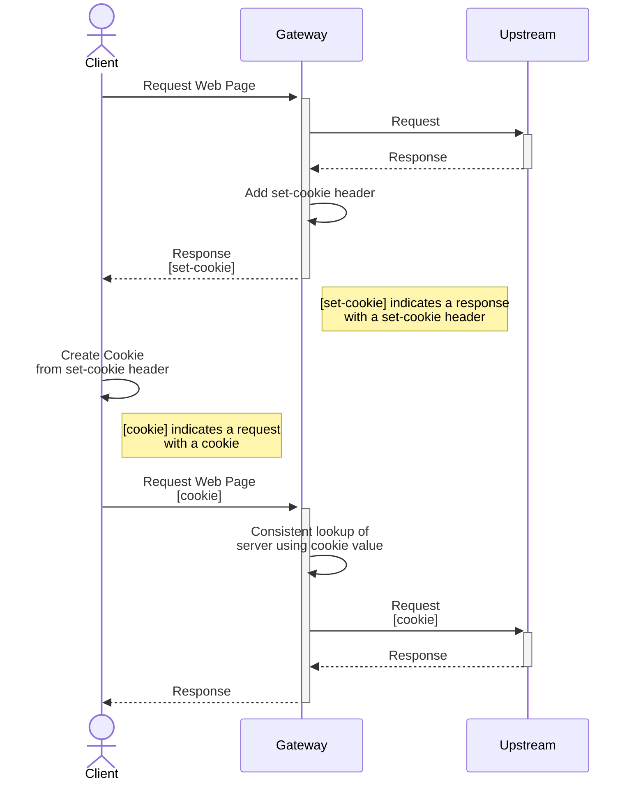
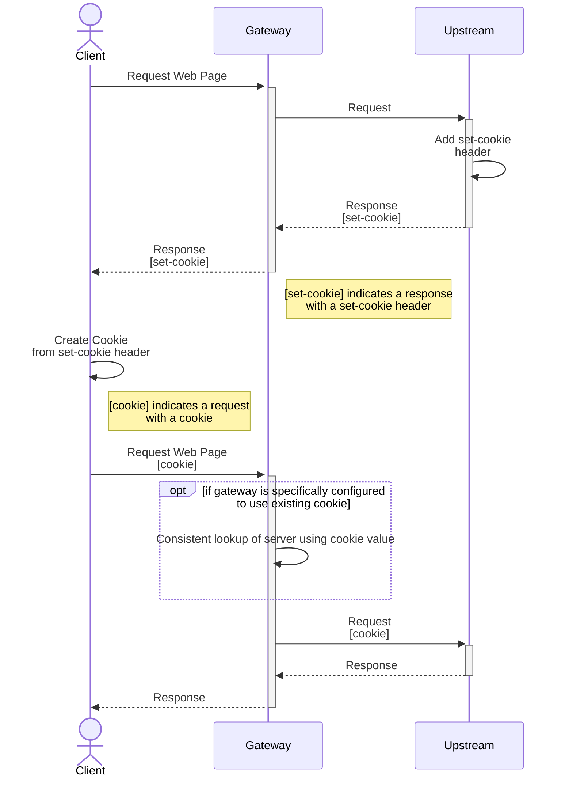
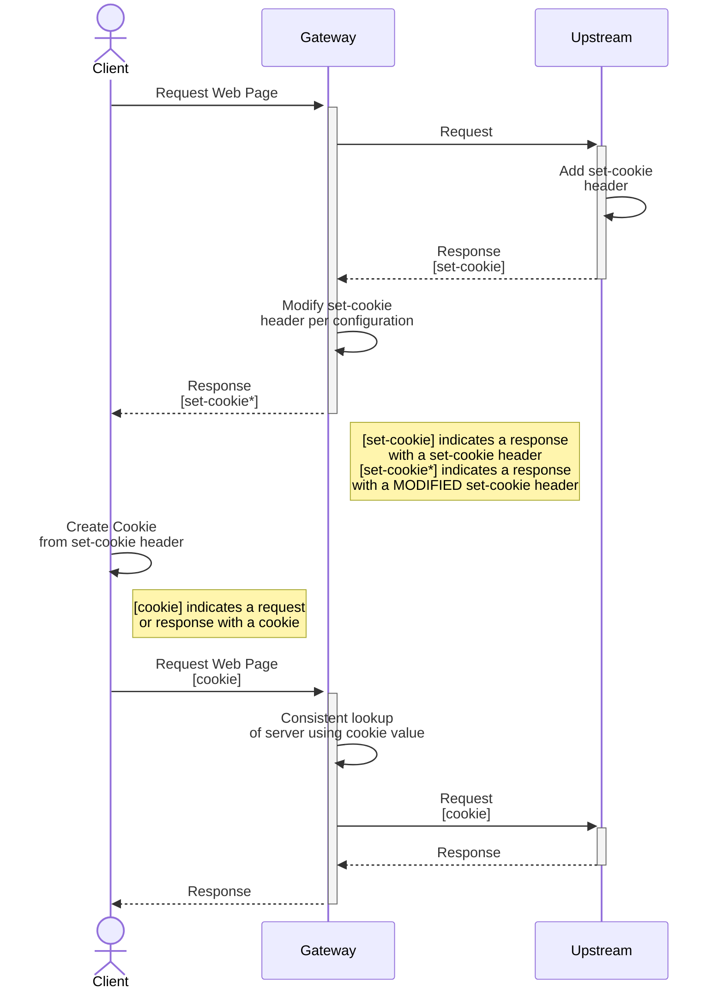

# GEP-1619: Session Persistence and Session Affinity

* Issue: [#1619](https://github.com/kubernetes-sigs/gateway-api/issues/1619)
* Status: Provisional

(See definitions in [GEP Status][/contributing/gep#status].)

## TLDR

This GEP proposes a definition of session persistence and session affinity as the foundation of future session persistence related improvements. This GEP also outlines the ways session persistence could be achieved by implementations.

## Goals
- Define session persistence and session affinity to establish a common language
- Identify differences in session persistence functionality between implementations

## Non-Goals
- Mandate a default or expected session persistence functionality for implementations

## Introduction

### Defining Session Persistence

Session persistence is when a client request is directed to the same backend server for the duration of a "session". It is achieved when a client directly provides information, such as a header, that a proxy uses as a reference to direct traffic to a specific server. Persistence is an exception to load balancing: a persistent client request bypasses the proxy's load balancing algorithm, going directly to a backend server it has previously established a session with.

Session persistence enables more efficient application workflows:
1. Better performance: Maintaining a single session allows a server to cache information about a client locally reducing the need for servers to exchange session data and overall storage needs.
2. Seamless client experience: Clients can reconnect to the same server without re-authenticating or re-entering their information.

Some of the concerns of session persistence are the duration and expiration of the session, security of the transaction stream, and storage of the context or state. 

Session affinity, not to be confused with session persistence, uses an existing attribute of the request to consistently send to the same backend. Session affinity can be considered a weaker form of session persistence: it is not guaranteed to persist a connection to the same backend server if certain attributes of the request or the backends are changed.

### Security and Privacy Implications

Session persistence can introduce security and privacy vulnerabilities if not properly implemented. These vulnerabilities can include:

1. Session hijacking: Attackers intercepting or predicting a valid session token to gain unauthorized access.
2. Session fixation: Attackers setting a client's session ID to a known value, which they can then use to hijack the session.
3. Session replay attacks: Attackers capturing and resending a client's message with a valid session ID.
4. Data leakage: Attackers can exploit sensitive session information cached on servers if not properly secured.
5. Denial of service attacks: Attackers can use up server resources by creating and maintaining large numbers of sessions.

To mitigate these security concerns, it is important to implement session persistence using secure practices, such as using strong session ID generation algorithms, implementing session timeouts, encrypting sensitive data, and monitoring server resources for unusual activity.

IP address reuse may also be a security or privacy concern when using session persistence or session affinity. If Kubernetes reuses an IP address of previously shutdown pod, the new pod may receive session persistent traffic meant for the old pod.

Session affinity introduces fewer security and privacy vulnerabilities since there are no session tokens to protect or exploit.

### Achieving Session Persistence

Session persistence is achieved using attributes residing in the application layer. The following are mechanisms for achieving session persistence:

**1. Cookie-Based Session Persistence**

The most common mechanism is by using cookies (described by [RFC6265](https://www.rfc-editor.org/rfc/rfc6265)) with the set-cookie HTTP response header. A client will use the provided value in the set-cookie response header in a cookie request header in subsequent requests. Proxies can use this cookie header to maintain a persistent connection to a single backend server on behalf of the client.

**2. Header-Based Session Persistence**

Header-based stateful sessions are achieved by a backend or gateway providing an HTTP response header and the client using the same header in subsequent HTTP requests. Proxies can use this header to maintain a persistent connection to a single backend server on behalf of the client.

**3. URL-Encoded Session Persistence**

Session information can be also encoded into the request URL to establish a persistent session. The server rewrites the client's URL to encode the new session information automatically. The server then decodes the session information from the URL to identify the session.

**Session Initiation**

For both header-based and cookie-based sessions, either the gateway or the backend server can initiate establishing the session via the appropriate header or set-cookie attributes. The following rules apply based on who initiates the session:

- If the backend initiates the session, the gateway should allow this and not force persistence connections, unless specifically configured to. The gateway may decode and alter the cookie established by the backend to achieve session persistence.
- If the gateway initiates the session, the backend will be presented with session attributes regardless if it enabled them. 

The client application also plays in a role in session initiation. If a client doesn't want a request to belong an existing session, it can remove the session cookie or identifier to signal the gateway or backend to recreate the session.

### Achieving Session Affinity

While session persistence uses attributes in the application layer, session affinity often uses, but is not limited to, attributes below the application layer. Session affinity doesn't require a session identifier like session persistence (e.g. a cookie), but instead uses existing connection attributes to establish a consistent hashing load balancing algorithm.

Session affinity can be achieved by deterministic load balancing algorithms or a proxy feature that tracks IP-to-backend associations such as [HAProxy's stick tables](https://www.haproxy.com/blog/introduction-to-haproxy-stick-tables/) or [Cilium's session affinity](https://docs.cilium.io/en/v1.12/gettingstarted/kubeproxy-free/#id2). 

### The Relationship of Session Persistence and Session Affinity

Although session persistence and session affinity may appear to be quite similar, it is important to recognize and understand their distinctions. As mentioned above, their distinctions are defined by what information they use to establish session consistency and whether consistency is guaranteed.

We can also examine how session persistence and session affinity functionally work together, by framing the relationship into a two tiered logical decision made by the data plane:
1. If the request contains a session persistence identity (e.g. a cookie or header), then route it directly to the backend it has previously established a session with.
2. If no session persistence identity is present, load balance as per load balancing configuration, taking into account the session affinity configuration (e.g. by utilizing a hashing algorithm that is deterministic).

This tiered decision-based logic is consistent with the idea that session persistence is an exception to load balancing. Though there are different ways to frame this relationship, this design will influence the separation between persistence and affinity API design.

### Implementations
In this section, we will describe how implementations achieve session persistence and affinity, along with a breakdown of related configuration options. Input from implementations is appreciated to complete this information.

In the following tables, we will example two types of APIs:
1. Dataplane APIs
2. Implementation APIs

Generally, the implementation API programs the dataplane API; however these two are not always clearly separated. The two types of APIs can use different API structures for configuring the same feature. Examining the dataplane APIs helps to remove the layer of API abstraction that implementations provide. Removing this layer avoids situations where implementations don’t fully implement all capabilities of a dataplane API or obfuscate certain configuration around session persistence. On the other hand, examining implementation APIs provides valuable data points in what implementations are interested in configuring.

**Session Persistence**

| **Technology** 	| **Technology Type** 	| **Session Persistence Type** 	| **Configuration Options** 	| **Configuration Association (Global, Gateway, Route, or Backends)** 	| **Notes** 	|
|---	|---	|---	|---	|---	|---	|
| Acnodal EPIC 	| Implementation (Envoy) 	| N/A 	| Supports Gateway API Only* 	| N/A 	| *Acnodal Epic solely uses Gateway API; therefore, it doesn’t yet have a way to configure session persistence. [Acnodal EPIC Docs](https://www.epick8sgw.io/docs/) 	|
| Apache APISIX 	| Implementation (Nginx) 	| [Cookie-Based](https://apisix.apache.org/docs/apisix/admin-api/#upstream) 	| hash_on=[vars \| header \| cookie \| consumer]<br>key=cookie_name 	| [Upstream](https://apisix.apache.org/docs/apisix/admin-api/#upstream) (Route or Backends) 	| N/A 	|
|  	| Implementation (Nginx) 	| [Header-Based](https://apisix.apache.org/docs/apisix/terminology/upstream/#header) 	| hash_on=[vars \| header \| cookie \| consumer]<br>key=header_name 	| [Upstream](https://apisix.apache.org/docs/apisix/admin-api/#upstream) (Route or Backends) 	| N/A 	|
| Apache httpd 	| Web Server 	| [Cookie-Based / URL-Encoded](https://httpd.apache.org/docs/2.4/mod/mod_proxy_balancer.html) 	| Cookie Attributes 	| N/A 	| N/A 	|
| Cilium 	| Implementation / Dataplane 	| None 	| None 	| None 	| Cilium has no documented way of doing session persistence. [Cilium Docs](https://cilium.io/)  	|
| Contour 	| Implementation (Envoy) 	| [Cookie-Based](https://projectcontour.io/docs/1.24/config/api/#projectcontour.io/v1.CookieRewritePolicy)  	| Name=name<br>pathRewrite=path<br>domainRewrite=domain<br>secure<br>sameSite 	| [Route](https://projectcontour.io/docs/1.24/config/api/#projectcontour.io/v1.Route) and [Service](https://projectcontour.io/docs/1.24/config/api/#projectcontour.io/v1.Service) (Backends) 	| Envoy does not natively support cookie attribute rewriting nor adding attributes other than path and TTL, but rewriting and adding additional attributes is possible via Lua ([Contour design reference](https://github.com/projectcontour/contour/blob/main/design/cookie-rewrite-design.md), [Envoy Issue](https://github.com/envoyproxy/envoy/issues/15612)). 	|
| Emissary-Ingress 	| Implementation (Envoy) 	| [Cookie-Based](https://www.getambassador.io/docs/emissary/latest/topics/running/load-balancer#cookie) 	| Name=name<br>Path=path<br>TTL=duration 	| [Module or Mapping](https://www.getambassador.io/docs/emissary/latest/topics/running/load-balancer#cookie) (Global or Route) 	| N/A 	|
|  	|  	| [Header-Based](https://www.getambassador.io/docs/emissary/latest/topics/running/load-balancer#header) 	| Name=name 	| [Module or Mapping](https://www.getambassador.io/docs/emissary/latest/topics/running/load-balancer#cookie) (Global or Route) 	| N/A 	|
| Envoy 	| Dataplane 	| [Cookie-Based](https://www.envoyproxy.io/docs/envoy/latest/api-v3/extensions/http/stateful_session/cookie/v3/cookie.proto) 	| Name=name<br>Path=path<br>TTL=duration 	| [HttpConnectionManager](https://www.envoyproxy.io/docs/envoy/latest/api-v3/extensions/filters/network/http_connection_manager/v3/http_connection_manager.proto) (Route) 	| Envoy does not natively support cookie attribute rewriting nor adding attributes other than path and TTL, but rewriting and adding additional attributes is possible via Lua ([Contour design reference](https://github.com/projectcontour/contour/blob/main/design/cookie-rewrite-design.md), [Envoy Issue](https://github.com/envoyproxy/envoy/issues/15612)). 	|
|  	|  	| [Header-Based](https://www.envoyproxy.io/docs/envoy/latest/api-v3/extensions/http/stateful_session/header/v3/header.proto) 	| Name=name 	| [HttpConnectionManager](https://www.envoyproxy.io/docs/envoy/latest/api-v3/extensions/filters/network/http_connection_manager/v3/http_connection_manager.proto) (Route) 	| N/A 	|
| Envoy Gateway 	| Implementation (Envoy) 	| N/A 	| Supports Gateway API Only* 	| N/A 	| *Envoy Gateway solely uses Gateway API; therefore, it doesn’t yet have a way to configure session persistence. [Envoy Gateway Docs](https://gateway.envoyproxy.io/v0.3.0/index.html) 	|
| Flomesh Service Mesh 	| Implementation / Dataplane (Pipy) 	| ? 	| ? 	| ? 	| ? 	|
| Gloo Edge 2.0 	| Implementation (Envoy) 	| [Cookie-Based](https://docs.solo.io/gloo-edge/latest/reference/api/envoy/api/v2/route/route.proto.sk/#cookie) 	| Name=name<br>Path=path<br>TTL=duration 	| [Route](https://docs.solo.io/gloo-edge/latest/reference/api/envoy/api/v2/route/route.proto.sk/#route) (Route) 	| N/A 	|
|  	|  	| [Header-Based](https://docs.solo.io/gloo-edge/latest/reference/api/envoy/api/v2/route/route.proto.sk/#hashpolicy) 	| Name=name 	| [Route](https://docs.solo.io/gloo-edge/latest/reference/api/envoy/api/v2/route/route.proto.sk/#route) (Route) 	| N/A 	|
| Google CloudRun 	| Implementation / Dataplane 	| [Cookie-Based](https://cloud.google.com/run/docs/configuring/session-affinity) 	| Enabled / Disabled 	| [Service](https://cloud.google.com/run/docs/configuring/session-affinity) (Backends) 	| Only allowed to turn off or on, no other configuration items 	|
| Google Kubernetes Engine 	| Implementation / Dataplane 	| [Cookie-Based](https://cloud.google.com/load-balancing/docs/backend-service#session_affinity) 	| GENERATED_COOKIE or HTTP_COOKIE=name<br>cookieTtlSec 	| [Backend Policy](https://cloud.google.com/kubernetes-engine/docs/how-to/configure-gateway-resources#session_affinity) (Backends) 	| Google Kubernetes Engine [lists](https://cloud.google.com/load-balancing/docs/backend-service#bs-session-affinity) the products that can do persistence/affinity mode. All persistence/affinity options are exclusive and can’t be used at the same time.<br>Note: Google Kubernetes Engine defines everything (persistence and affinity) as session affinity. 	|
|  	|  	| [Header-Based](https://cloud.google.com/load-balancing/docs/backend-service#header_field_affinity) 	| httpHeaderName=name 	| [Backend Policy](https://cloud.google.com/kubernetes-engine/docs/how-to/configure-gateway-resources#session_affinity) (Backends) 	| N/A 	|
| HAProxy 	| Dataplane 	| [Cookie-Based](https://docs.haproxy.org/2.6/configuration.html#4.2-cookie) 	| name=name<br>[rewrite \| insert \| prefix ]<br>indirect<br>nocache<br>postonly<br>preserve<br>httponly<br>secure<br>domain=domain<br>maxidle=idle<br>maxlife=life<br>dynamic<br>attr=value 	| [Default or Backends](https://docs.haproxy.org/2.6/configuration.html#4.2-cookie) (Global or Backends) 	| HAProxy allows for operational cookie strategy configuration (i.e. when/how HAProxy should inject cookies) 	|
| HAProxy Ingress 	| Implementation (HAProxy) 	| [Cookie-Based](https://haproxy-ingress.github.io/docs/configuration/keys/#affinity) 	| affinity (enable/disable)<br>cookie-key=key<br>session-cookie-domain=domain<br>session-cookie-dynamic=[true \| false]<br>session-cookie-keywords=keywords<br>session-cookie-name=name<br>session-cookie-preserve=[true \| false]<br>session-cookie-same-site=[true \| false]<br>session-cookie-shared=[true \| false]<br>session-cookie-strategy=strategy<br>session-cookie-value-strategy=value_strategy	 	| [Backend](https://haproxy-ingress.github.io/docs/configuration/keys/#affinity) (Backends) 	| N/A 	|
| Hashicorp Consul  	| Implementation (Envoy) 	| N/A 	| Supports Gateway API Only* 	| N/A 	| *Hashicorp Consul solely uses Gateway API; therefore, it doesn’t yet have a way to configure session persistence. [Hashicorp Consul API Gateway Docs](https://developer.hashicorp.com/consul/docs/api-gateway) 	|
| Istio 	| Implementation (Envoy) 	| [Cookie-Based](https://istio.io/latest/docs/reference/config/networking/destination-rule/#LoadBalancerSettings-ConsistentHashLB-HTTPCookie) 	| Name=name<br>Path=path<br>TTL=duration 	| [ConsistentHashLB](https://istio.io/latest/docs/reference/config/networking/destination-rule/#LoadBalancerSettings-ConsistentHashLB) (Backends) 	| Istio also supports turning on cookie-based session persistence via the Pilot ENV variable [PILOT_PERSISTENT_SESSION_LABEL](https://istio.io/latest/docs/reference/commands/pilot-discovery/#envvars). 	|
|  	| Implementation (Envoy) 	| [Header-Based](https://istio.io/latest/docs/reference/config/networking/destination-rule/#LoadBalancerSettings-ConsistentHashLB) 	| Name=name 	| [ConsistentHashLB](https://istio.io/latest/docs/reference/config/networking/destination-rule/#LoadBalancerSettings-ConsistentHashLB) (Backends) 	| N/A 	|
| Java Servlet 	| Web Server 	| [Cookie-Based / URL-Encoded](https://docs.oracle.com/javaee/7/api/javax/servlet/http/HttpSession.html) 	| invalidate()<br>setAttribute(String name, Object value)<br>setMaxInactiveInterval(int interval) 	| N/A 	| Java Servlets do not natively support proxy functions. 	|
| Kong 	| Implementation / Dataplane 	| [Cookie-Based](https://docs.konghq.com/hub/kong-inc/session/) 	| cookie_name=name<br>rolling_timeout=timeout<br>absolute_timeout=timeout<br>idling_timeout=timeout<br>cookie_path=path<br>cookie_domain=domain<br>cookie_same_site=[Strict \| Lax \| None \| off]<br>cookie_http_only<br>cookie_secure=[true \| false]<br>stale_ttl=duration<br>cookie_persistent=[true \| false]<br>storage=storage_type 	| [Route, Service, Global](https://docs.konghq.com/hub/kong-inc/session/) (Route or Backends or Global) 	| N/A 	|
|  	|  	| [Header-Based](https://docs.konghq.com/gateway/latest/how-kong-works/load-balancing/#balancing-algorithms) 	| name 	| [Upstreams](https://docs.konghq.com/gateway/3.2.x/admin-api/#add-upstream) (Backends) 	| N/A 	|
| Kuma 	| Implementation (Envoy) 	| None 	| None 	| None 	| Kuma has no documentation on how it supports session persistence or cookies. [Kuma Docs](https://kuma.io/docs/2.1.x/) 	|
| Nginx  	| Dataplane 	| [Cookie-Based (Nginx Plus Only)](https://docs.nginx.com/nginx/admin-guide/load-balancer/http-load-balancer/#enabling-session-persistence) 	| Name=name<br>Expires=time<br>Domain=domain<br>HttpOnly<br>SameSite = [strict \| lax \| none \| $variable]<br>Secure<br>path=path 	| [Upstream](https://docs.nginx.com/nginx/admin-guide/load-balancer/http-load-balancer/#enabling-session-persistence) (Backends) 	| See also [Sticky Cookie](https://nginx.org/en/docs/http/ngx_http_upstream_module.html?&_ga=2.184452070.1306763907.1680031702-1761609832.1671225057#sticky_cookie) 	|
| NGINX Kubernetes Gateway 	| Implementation (Nginx) 	| N/A 	| Supports Gateway API Only* 	| N/A 	| *NGINX Kubernetes Gateway solely uses Gateway API; therefore, it doesn’t yet have a way to configure session persistence. [Nginx Kubernetes Gateway Docs](https://github.com/nginxinc/nginx-kubernetes-gateway) 	|
| Traefik 	| Implementation / Dataplane 	| [Cookie-Based](https://doc.traefik.io/traefik/routing/services/#sticky-sessions) 	| name=name<br>secure<br>httpOnly<br>sameSite=[none \| lax \| strict ] 	| [Services](https://doc.traefik.io/traefik/routing/services/#sticky-sessions) (Backends) 	| N/A 	|

**Session Affinity**

| **Technology** 	| **Technology Type** 	| **Session Affinity Type** 	| **Notes** 	|
|---	|---	|---	|---	|
| Acnodal EPIC 	| Implementation (Envoy) 	| Supports Gateway API Only* 	| *Acnodal Epic solely uses Gateway API; therefore, it doesn’t yet have a way to configure session affinity. [Acnodal EPIC Docs](https://www.epick8sgw.io/docs/) 	|
| Apache APISIX 	| Implementation (Nginx) 	| [Consistent Hashing](https://apisix.apache.org/docs/apisix/plugins/traffic-split/#attributes) via consumer ID or other variables 	| N/A 	|
| Cilium 	| Implementation / Dataplane 	| [Source IP Address](https://docs.cilium.io/en/v1.12/gettingstarted/kubeproxy-free/#id2) (Default) 	| N/A 	|
| Contour 	| Implementation (Envoy) 	| Consistent Hashing via [RequestHash](https://projectcontour.io/docs/1.24/config/request-routing/#load-balancing-strategy) 	| N/A 	|
| Emissary-Ingress 	| Implementation (Envoy) 	| Consistent Hashing via [sourceIP](https://www.getambassador.io/docs/emissary/latest/topics/running/load-balancer#source-ip) 	| N/A 	|
| Envoy 	| Dataplane 	| Consistent Hashing via [Maglev](https://www.envoyproxy.io/docs/envoy/latest/intro/arch_overview/upstream/load_balancing/load_balancers#maglev) and [Ring Hash](https://www.envoyproxy.io/docs/envoy/latest/intro/arch_overview/upstream/load_balancing/load_balancers#ring-hash) 	| N/A 	|
| Envoy Gateway 	| Implementation (Envoy) 	| Supports Gateway API Only* 	| *Envoy Gateway solely uses Gateway API; therefore, it doesn’t yet have a way to configure session affinity. [Envoy Gateway Docs](https://gateway.envoyproxy.io/v0.3.0/index.html) 	|
| Flomesh Service Mesh 	| Implementation / Dataplane (Pipy) 	| ? 	| ? 	|
| Gloo Edge 2.0 	| Implementation (Envoy) 	| Consistent Hashing via HashPolicy of [SourceIP](https://docs.solo.io/gloo-edge/latest/reference/api/envoy/api/v2/route/route.proto.sk/#connectionproperties) 	| N/A 	|
| Google CloudRun	 	| Implementation / Dataplane 	| None 	| [Google CloudRun Docs](https://cloud.google.com/run/docs) 	|
| Google Kubernetes Engine 	| Implementation / Dataplane 	| [CLIENT_IP_NO_DESTINATION](https://cloud.google.com/load-balancing/docs/backend-service#client-ip-no-destination-affinity) and [CLIENT_IP](https://cloud.google.com/load-balancing/docs/backend-service#client_ip_affinity) 	| Google Kubernetes Engine [lists](https://cloud.google.com/load-balancing/docs/backend-service#bs-session-affinity) the products that can do persistence/affinity mode. Session affinity settings are fulfilled only if the load balancing locality policy (LocalityLbPolicy) is set to RING_HASH or MAGLEV. All persistence/affinity options are exclusive and can’t be used at the same time.<br>Note: Google Kubernetes Engine defines everything (persistence and affinity) as session affinity. 	|
| HAProxy 	| Dataplane 	| [Stick Tables](https://cbonte.github.io/haproxy-dconv/2.4/configuration.html#4-stick-table) using connection attributes 	| N/A 	|
| HAProxy Ingress 	| Implementation (HAProxy) 	| None 	| [Haproxy Ingress Docs](https://haproxy-ingress.github.io/docs/configuration/keys/) 	|
| Hashicorp Consul  	| Implementation (Envoy) 	| Supports Gateway API Only* 	| *Hashicorp Consul solely uses Gateway API; therefore, it doesn’t yet have a way to configure session affinity. [Hashicorp Consul API Gateway Docs](https://developer.hashicorp.com/consul/docs/api-gateway) 	|
| Istio 	| Implementation (Envoy) 	| Consistent Hashing via [ConsistentHashLB](https://istio.io/latest/docs/reference/config/networking/destination-rule/#LoadBalancerSettings-ConsistentHashLB) with Maglev or Ring Hash  	| N/A 	|
| Kong 	| Implementation / Dataplane 	| [Consistent Hashing](https://docs.konghq.com/gateway/latest/how-kong-works/load-balancing/#balancing-algorithms) via Source IP or Consumer ID 	| N/A 	|
| Kuma 	| Implementation (Envoy) 	| Consistent Hashing via [Ring Hash](https://kuma.io/docs/2.1.x/policies/traffic-route/#load-balancer-types) 	| N/A 	|
| Nginx 	| Dataplane 	| [Consistent Hashing](https://nginx.org/en/docs/http/ngx_http_upstream_module.html#hash) via IP or other connection attributes (Nginx Open Source) 	| N/A 	|
| NGINX Kubernetes Gateway 	| Implementation (Nginx) 	| Supports Gateway API Only* 	| *NGINX Kubernetes Gateway solely uses Gateway API; therefore, it doesn’t yet have a way to configure session affinity. [Nginx Kubernetes Gateway Docs](https://github.com/nginxinc/nginx-kubernetes-gateway) 	|
| Traefik 	| Implementation / Dataplane 	| None 	| [Traefik Docs](https://doc.traefik.io/traefik/) 	|

### Sessions in Java

Java application servers such as Tomcat and Jetty, were the first to standardize the API around persistent sessions. These Java applications introduced the “jsessionid” cookie as well as more advanced features such as session migration, replication, and on demand session activation. It’s important for Gateway API to examine persistent session use cases and history from Java APIs to ensure the API is designed appropriately.

### Use Cases

These use cases are presented as an aid for discussion, and as frames of reference for how users may attempt to utilize
the outputs of this GEP. They are not an exhaustive list of features for session persistence support in Gateway API nor
does a particular use case inclusion necessarily imply that it is a goal.

#### Cookies

_As an app developer,_
1. **I want the gateway to insert a cookie to create a persistent session.**

   This represents the most straightforward scenario for utilizing cookies in Gateway API. When a request is made, the
gateway includes the `set-cookie` header in the final response, prompting the client to generate a cookie. This cookie
is subsequently used in future requests, allowing the gateway to consistently choose the same upstream, establishing a
persistent session.



2. **I want the upstream to add a cookie to create a persistent session.**

   In cases where the upstream initiates the session by adding the `set-cookie` header before the proxy has the chance 
to add it, the proxy should refrain from establishing a persistent session unless explicitly configured to do so. Given
that the Gateway API's cookie interface, as outlined in this GEP, does not include a configuration option for such
scenarios, implementations should refrain from establishing a persistent session in this specific use case.



3. **I want the backend to add a cookie to create a persistent session and I want the gateway to update the cookie.**

   If an application developer desires the gateway to utilize and/or update a cookie when it is created by the upstream
server, the gateway will modify the `set-cookie` header provided by the upstream server. The primary motivation behind
gateways updating the cookie is to rewrite the cookie value with a server identifier in order to maintain persistent
sessions.



4. **I want to configure traffic splitting for my route.**

## API

### Session Persistence API

Although some implementations and dataplanes support session persistence through headers, cookies are more universally
supported and portable; therefore, this GEP will focus on implementing cookie-based session persistence.

To determine how the session persistence API should be designed, we must consider the following:
1. Who is responsible for configuring it?
2. What existing API object(s) is it augmenting?
3. What are the practical implications of attaching session persistence to an existing API object?
4. How are existing implementation APIs designed?

**Who is responsible for configuring it?**

Referring to the [Gateway API Security Model](https://gateway-api.sigs.k8s.io/concepts/security-model/#roles-and-personas),
the target kubernetes role/persona for session persistence, are application developers. In most cases, session
persistence is not considered an optional feature, but rather a necessary and deliberate component incorporated into the
application's architecture by the developers themselves. Consequently, application developers should be responsible for
adjusting the configuration to ensure the functionality of their applications.

**What existing API object(s) is it augmenting?**

Session persistence augments both the concepts of routes and services.

A Kubernetes service is an abstract representation of a set of pods that work together to provide a specific
functionality. Services perform load balancing, routing traffic from a service endpoint to a pod. Therefore, session
persistence augments the load balancing functionality of the service by consistently directing traffic to the same pod.

On the other hand, session persistence also augments routing. An xRoute, as defined by Gateway API, specifies how
requests from a Gateway listener to an API object (such as a service) are routed. In routing scenarios involving traffic
splitting, session persistence augments the routing behavior. When a persistent session is established and traffic
splitting is configured across services, the persistence to a single backend should be maintained across services. In
other words, the persistent routing behavior should disregard the traffic splitting configuration and remain consistent.

**What are the practical implications of attaching session persistence to an existing API object?**

One practical implication of attaching session persistence configuration to services is its reusability across multiple
routes. This reusability can be advantageous as it eliminates the need for repetitive session persistence configuration
for each individual route. However, on the flip side, it also mandates the inclusion of session persistence
configuration for every route that utilizes the service.

Conversely, when attaching session persistence configuration to xRoutes, it becomes possible to establish a clear
relationship that it augments routing behavior, particularly in scenarios involving traffic splitting. However, as
mentioned earlier, session persistence would need to be individually configured for each specific route.

**How are existing implementation APIs designed?**

Referring to our [Implementations](#Implementations) tables on session persistence, the majority of Gateway API
implementations designed session persistence in their APIs to be attached to a service or backends. This should be
considered cautiously, as making associations to Gateway API's notion of Gateway, Route, and Service to other
implementation's objects is hard to directly translate. The idea of a route in Gateway API is often not the same as a
route in any given implementation.

Taking Istio as an example, it offers an attachment point of session persistence to a service through a [`DestinationRule`](https://istio.io/latest/docs/reference/config/networking/destination-rule/#DestinationRule).
`DestinationRule` defines policies that apply to traffic intended for a service after routing has occurred. Within
`DestinationRule`, Istio couples the selection of load balancing algorithms with session persistence via their [`LoadBalancerSettings`](https://istio.io/latest/docs/reference/config/networking/destination-rule/#LoadBalancerSettings).
When designing our API structure, it is important to consider the balance between incorporating additional load
balancing policies coupled with session persistence, rather than configuring session persistence independently.

On the other hand, rather than being attached to a service, Envoy configures session persistence at the route-level
through an [`HttpFilter`](https://www.envoyproxy.io/docs/envoy/latest/api-v3/extensions/filters/network/http_connection_manager/v3/http_connection_manager.proto#extensions-filters-network-http-connection-manager-v3-httpfilter).
As previously mentioned, this approach allows data plane entities to implement session persistence across services
(clusters), thereby augmenting routing behavior in scenarios involving traffic splitting.

#### Session Persistence API with GAMMA

The object of the [GAMMA (Gateway API for Mesh Management and Administration)](https://gateway-api.sigs.k8s.io/contributing/gamma/)
initiative is to provide support for service mesh and mesh-adjacent use-cases with Gateway API. Mesh traffic routing with
Mesh traffic routing with Gateway API is accomplished with `xRoutes` specifying service-to-service traffic opposed to
gateway-to-service traffic.

Given that service meshes commonly have session persistence requirements, this API design should take into consideration
session persistence needs in GAMMA and service mesh scenarios.

#### API Design

Since session persistence needs to augment a service, we implement as a metaresource policy as described in [Policy Attachment](https://gateway-api.sigs.k8s.io/references/policy-attachment/#direct-policy-attachment).
The metaresource is named `SessionPersistencePolicy` and is only responsible for configuring session persistence for
services. It is defined as a [Direct Policy Attachment](https://gateway-api.sigs.k8s.io/v1alpha2/references/policy-attachment/#direct-policy-attachment)
without defaults or overrides, applied to the service it is targeting.

**Cookie Attributes**

A cookie consists of a collection of attributes. These attributes are pairs of key=value, where the value is optional
for certain attributes. The cookie name attribute is the only mandatory attribute while all other cookie attributes
are optional.

The cookie attributes defined by [RFC6265](https://www.rfc-editor.org/rfc/rfc6265#section-5.2) are:
- Name=_value_
- Expires=_date_
- Max-Age=_number_
- Domain=_domain_
- Path=_path-value_
- Secure
- HttpOnly

Other cookie attributes not defined by RFC6265, but are captured in draft RFCs and could be considered de facto
standards due to wide acceptance are:
- SameSite=[Strict|Lax|None]
- Partitioned

We implement core support for the `Name`, `Path`, and `TTL` attributes as the metrics in [implementations](#Implementations)
for session persistence shows these being the most widely adopted and supported. Subsequently, we proceed with `Domain`,
`SameSite`, `HttpOnly`, and `Secure` as extended support, considering their partial acceptance among APIs. The
`Partitioned` attribute lacks support in any implementation API and will be omitted. Similarly, since the `Expires`
attribute is redundant compared to the preferred `Max-Age` attribute, it will also be skipped.

```go
// SessionPersistencePolicy provides a way to define session persistence rules
// for a service.
//
// Support: Core
type SessionPersistencePolicy struct {
    metav1.TypeMeta   `json:",inline"`
    metav1.ObjectMeta `json:"metadata,omitempty"`
    
    // Spec defines the desired state of SessionPersistencePolicy.
    Spec SessionPersistencePolicySpec `json:"spec"`
    
    // Status defines the current state of SessionPersistencePolicy.
    Status SessionPersistencePolicyStatus `json:"status,omitempty"`
}

// SessionPersistencePolicySpec defines the desired state of
// SessionPersistencePolicy.
// Note: there is no Override or Default policy configuration.
type SessionPersistencePolicySpec struct {
    // TargetRef identifies an API object to apply policy to.
    // HttpRoutes, GRPCRoute, Services are the only valid API target 
    // references.
    TargetRef gatewayv1a2.PolicyTargetReference `json:"targetRef"`
    
    // HttpCookie defines and configures a cookie to achieve
    // session persistence. 
    HttpCookie *HttpCookie `json:"httpCookie"`
}

// HttpCookie defines a cookie to achieve session persistence.
//
// Support: Core
type HttpCookie struct {
    // Name defines the cookie's name. Although the cookie name
    // attribute is necessary, this field is optional. In cases
    // where this field is left empty, the implementation will
    // assign a default cookie name.
    //
    // Support: Core
    //
    // +optional
    // +kubebuilder:validation:MaxLength=4096
    Name String `json:"name,omitempty"`

    // Path defines the cookie's Path attribute. If this
    // field is left empty, the Path cookie attribute will
    // not be configured.
    //
    // Support: Core
    //
    // +optional
    // +kubebuilder:validation:MaxLength=4096
    Path String `json:"path,omitempty"`

    // TTL defines the cookie's Max-Age attribute. TTL will
    // always be specified in seconds. If this field is left
    // empty, the Max-Age cookie attribute will not be configured.
    // 
    // Support: Core
    //
    // +optional
    TTL int64 `json:"ttl,omitempty"`

    // SameSite defines the cookie's SameSite attribute. If
    // this field is left empty, the SameSite cookie attribute
    // will not be configured.
    //
    // Support: Extended
    //
    // +optional
    // +kubebuilder:validation:Enum=Strict;Lax;None
    SameSite SameSiteType `json:"sameSite,omitempty"`

    // Domain defines the cookie's Domain attribute. If
    // this field is left empty, the Domain cookie attribute
    // will not be configured.
    //
    // Support: Extended
    //
    // +optional
    // +kubebuilder:validation:MaxLength=4096
    Domain String `json:"domain,omitempty"`

    // Secure defines the cookie's Secure attribute. If
    // this field is left empty, the Secure cookie attribute
    // will not be configured.
    //
    // Support: Extended
    //
    // +optional
    Secure SecureMode `json:"secure,omitempty"`

    // HttpOnly defines the cookie's HttpOnly attribute. If
    // this field is left empty, the HttpOnly cookie attribute
    // will not be configured.
    //
    // Support: Extended
    //
    // +optional
    HttpOnly HttpOnlyMode `json:"httpOnly,omitempty"`
}

// SameSiteType defines a cookie's SameSite attribute.
type SameSiteType string

const (
    // SameSiteNone specifies None as the samesite cookie attribute.
    SameSiteNone SameSiteType = "None"
    // SameSiteLax specifies Lax as the samesite cookie attribute.
    SameSiteLax SameSiteType = "Lax"
    // SameSiteStrict specifies Strict as the samesite cookie attribute.
    SameSiteStrict SameSiteType = "Strict"
)

// SecureModeType defines a cookie's Secure attribute.
type SecureModeType string

const (
    // SecureModeDefault specifies to NOT include the Secure cookie attribute.
    SecureModeDefault SecureModeType = ""
    // SecureModeSecure specifies the Secure cookie attribute.
    SecureModeSecure SecureModeType = "Secure"
)

// HttpOnlyMode defines a cookie's HttpOnly attribute.
type HttpOnlyMode string

const (
    // HttpOnlyModeDefault specifies to NOT include the HttpOnly cookie attribute.
    HttpOnlyModeDefault HttpOnlyMode = ""
    // HttpOnlyModeHttpOnly specifies the HttpOnly cookie attribute.
    HttpOnlyModeHttpOnly HttpOnlyMode = "HttpOnly"
)

// SessionPersistencePolicyStatus defines the observed state of SessionPersistencePolicy.
type SessionPersistencePolicyStatus struct {
    // Conditions describe the current conditions of the SessionPersistencePolicy.
    //
    // Implementations should prefer to express SessionPersistencePolicy
    // conditions using the `SessionPersistencePolicyConditionType` and
    // `SessionPersistencePolicyConditionReason` constants so that
    // operators and tools can converge on a common vocabulary to
    // describe SessionPersistencePolicy state.
    // Known condition types are:
    //
    // * “Accepted”
    //
    // +optional
    // +listType=map
    // +listMapKey=type
    // +kubebuilder:validation:MaxItems=8
    // +kubebuilder:default={type: "Accepted", status: "Unknown", reason:"Pending", message:"Waiting for validation", lastTransitionTime: "1970-01-01T00:00:00Z"}
    Conditions []metav1.Condition `json:"conditions,omitempty"`
}

// SessionPersistencePolicyConditionType is the type of condition used
// as a signal by SessionPersistencePolicy. This type should be used with
// the SessionPersistencePolicy.Conditions field.
type SessionPersistencePolicyConditionType string

// SessionPersistencePolicyConditionReason is a reason that explains why a
// particular SessionPersistencePolicyConditionType was generated. This reason
// should be used with the SessionPersistencePolicy.Conditions field.
type SessionPersistencePolicyConditionReason string

const (
    // This condition indicates that the SessionPersistencePolicyStatus has been
    // accepted as valid.
    // Possible reason for this condition to be True is:
    //
    // * “Accepted”
    //
    // Possible reasons for this condition to be False are:
    //
    // * “Invalid”
    // * “Pending”
    SessionPersistencePolicyConditionAccepted SessionPersistencePolicyConditionType = “Accepted”

    // This reason is used with the “Accepted” condition when the condition is true.
    SessionPersistencePolicyReasonAccepted SessionPersistencePolicyConditionReason = “Valid”

	// This reason is used with the “Accepted” condition when the SessionPersistencePolicy is invalid, e.g. crossing namespace boundaries.
    SessionPersistencePolicyReasonInvalid SessionPersistencePolicyConditionReason = “Invalid”

    // This reason is used with the “Accepted” condition when the SessionPersistencePolicy is pending validation.
    SessionPersistencePolicyReasonPending SessionPersistencePolicyConditionReason = “Pending”
)
```

### Session Affinity API

TBD - See [open question](#open-questions) about session affinity API

### Open Questions

- Should we include both session persistence and session affinity API configurations in this GEP or just focus on session persistence?
- Should both session persistence and session affinity be designed as common load balancing policy API? Should they be configured as separately in the API?
- What happens when session persistence is broken because the backend is not up or healthy? If that's an error case, how should that be handled? Should the API dictate the http error code? Or should the API dictate fall back behavior?

## TODO
The following are items that we intend to resolve before we consider this GEP implementable:

- We need to identify the needs and use cases from end users for specifying session persistence.
- We need to identify and document requirements regarding session draining and migration. How do implementations drain established sessions during backend upgrades without disruption?
- We need to document sessions with Java in greater detail. Java standardized the API and behavior of session persistence long ago and would be worth examining.
- We need to add a small section on compliance regarding the browser and client relationship.
- We need to design and document an API for session affinity in the Gateway API spec (see [open question](#open-questions) about API design)

## Alternatives

### Alternate Session Persistence API

Alternatively, the API for Session Persistence could define a loosely-typed list of attributes instead of strongly-typed
attribute fields. This approach offers a more flexible specification, particularly when new attributes need to be
introduced. However, loosely-typed lists may not be as user-friendly due to the lack of validation.

```go
// HttpCookie defines a cookie to achieve session persistence.
//
// Support: Core
type HttpCookie struct {
    // Name defines the cookie's name.
    //
    // Support: Core
    //
    // +kubebuilder:validation:MaxLength=4096
    Name String `json:"name,omitempty"`
    
    // CookieAttributes defines the cookie's attributes.
    //
    // Support: Core
    // +optional
    CookieAttributes []CookieAttribute `json:cookieAttributes`
}

// CookieAttribute defines the cookie's attributes.
type CookieAttribute map[string][]string
)
```

The API could also be a mix of individual fields and listed attributes. More specifically, we could separate the key
attributes with no value into a list. This approach is taken by [Haproxy Ingress](https://haproxy-ingress.github.io/docs/configuration/keys/#affinity)
with their `session-cookie-keywords` field. This provides flexibility for simple boolean-typed attributes, while
validating attributes that have values. However, this approach may be confusing to users as uses two different API
patterns for cookie attributes.

```go
// HttpCookie defines a cookie to achieve session persistence.
//
// Support: Core
type HttpCookie struct {
    // Name defines the cookie's name.
    //
    // Support: Core
    //
    // +kubebuilder:validation:MaxLength=4096
    Name String `json:"name,omitempty"`

    // SameSite defines the cookie's SameSite attribute.
    //
    // Support: Extended
    //
    // +optional
    // +kubebuilder:validation:Enum=Strict;Lax;None
    SameSite SameSiteType `json:"sameSite,omitempty"`
    
    // Domain defines the cookie's Domain attribute.
    //
    // Support: Extended
    //
    // +optional
    // +kubebuilder:validation:MaxLength=4096
    Domain String `json:"domain,omitempty"`
    
    // CookieKeywords defines the cookie's attributes that have no value.
    //
    // Support: Extended
    // +optional
    CookieKeywords []CookieKeyword `json:cookieKeywords`
}

// CookieKeyword defines the cookie's attributes that have no value.
type CookieKeyword string

const (
    // CookieKeywordsHttpOnly specifies the HttpOnly cookie attribute.
    CookieKeywordsHttpOnly HttpOnlyMode = "HttpOnly"
    // CookieKeywordsSecure specifies the Secure cookie attribute.
    CookieKeywordsSecure HttpOnlyMode = "Secure"
)
```

Taking a different approach, this GEP could design a generic approach to configuring load balancing policy. Instead of
only having a metaresource specifically for session persistence, a metaresource called `LoadBalancerPolicy` of which
includes a field for session persistence along with other load balancer related configuration.

The `LoadBalancerPolicy` design provides tighter coupling with other load balancing configuration which help reduce CRD
proliferation, but may limit API flexibility as it forces coupling between concepts that may not be appropriate for
current and future implementations.

```go
// LoadBalancerPolicy provides a way to define load balancing rules
// for a service.
//
// Support: Core
type LoadBalancerPolicy struct {
    metav1.TypeMeta   `json:",inline"`
    metav1.ObjectMeta `json:"metadata,omitempty"`

    // Spec defines the desired state of LoadBalancerPolicy.
    Spec LoadBalancerPolicySpec `json:"spec"`

    // Status defines the current state of LoadBalancerPolicy.
    Status LoadBalancerPolicyStatus `json:"status,omitempty"`
}

// LoadBalancerPolicySpec defines the desired state of
// LoadBalancerPolicy.
// Note: there is no Override or Default policy configuration.
type LoadBalancerPolicySpec struct {
    // TargetRef identifies an API object to apply policy to.
    // Services are the only valid API target references.
    TargetRef gatewayv1a2.PolicyTargetReference `json:"targetRef"`

    // SessionPersistence defines and configures session persistence.
    SessionPersistence *SessionPersistence `json:"sessionPersistence"`
    
    // BalanceAlgorithm defines and configures the load balancer
    // balancing algorithm.
    BalanceAlgorithm *BalanceAlgorithm `json:"balanceAlgorithm"`
}

// SessionPersistence defines and configures session persistence.
//
// Support: Core
type SessionPersistence struct {
    // HttpCookie defines and configures a cookie to achieve
    // session persistence.
    //
    // Support: Core
    HttpCookie *HttpCookie `json:"httpCookie"`
}
```

### Alternate Naming

This GEP describes session persistence and session affinity as the idea of strong and weak connection persistence respectively. Other technologies use different names or define persistence and affinity differently:

- Envoy defines [stateful sessions](https://www.envoyproxy.io/docs/envoy/latest/api-v3/extensions/http/stateful_session/cookie/v3/cookie.proto) as what we've defined as session persistence
- Google Cloud defines [session affinity](https://cloud.google.com/run/docs/configuring/session-affinity) as what we've defined as session persistence
- Nginx defines [session persistence](https://docs.nginx.com/nginx/admin-guide/load-balancer/http-load-balancer/#enabling-session-persistence) as what we've defined as both session persistence and affinity
- Traefik defines [sticky sessions](https://doc.traefik.io/traefik/routing/services/#sticky-sessions) as what we've defined as session persistence
- Apache httpd defines [sticky sessions or stickyness](https://httpd.apache.org/docs/2.4/mod/mod_proxy_balancer.html) as what we've defined as session persistence
- Kubernetes defines [session affinity](https://kubernetes.io/docs/reference/networking/virtual-ips/#session-affinity) based on client IP hashing (same as our session affinity)

Though session persistence is a ubiquitous name, session affinity is more inconsistently used. An alternate decision could be made to use a different name for session affinity based on the prevalence of other naming conventions.

## References

- [LBPolicy](https://static.sched.com/hosted_files/kccnceu2023/c4/Autoscaling%20Elastic%20Kubernetes%20Infrastructure%20for%20Stateful%20Applications%20using%20Proxyless%20gRPC%20and%20Istio.pdf#page=25) (proposed extension for session persistence API)
- [gRPC Stateful Session Affinity Proposal](https://github.com/grpc/proposal/blob/master/A55-xds-stateful-session-affinity.md) (info on session draining and session persistence in gRPC)
- [Kube-Proxy Session Affinity](https://kubernetes.io/docs/reference/networking/virtual-ips/#session-affinity)
- [GEP-713: Metaresources and PolicyAttachment](https://gateway-api.sigs.k8s.io/geps/gep-713/)
- [RFC6265](https://www.rfc-editor.org/rfc/rfc6265)
- [Policy Attachment](https://gateway-api.sigs.k8s.io/references/policy-attachment/#direct-policy-attachment)
- [Envoy Session Persistence Design Doc](https://docs.google.com/document/d/1IU4b76AgOXijNa4sew1gfBfSiOMbZNiEt5Dhis8QpYg/edit#heading=h.sobqsca7i45e)
- [Envoy Session Persistence Issue](https://github.com/envoyproxy/envoy/issues/16698)